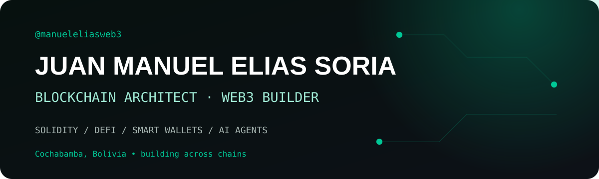

<picture>
  <source media="(prefers-color-scheme: dark)" srcset="assets/banner-dark.svg">
  <source media="(prefers-color-scheme: light)" srcset="assets/banner-light.svg">
  
</picture>

 

 

&nbsp;
&nbsp;

  

---

## This is me :)

Hi, I'm **Manuel Elias**, a Blockchain Architect and Web3 builder from Bolivia 🇧🇴.

For more than five years, I have designed and shipped on-chain and off-chain systems across Ethereum, Base, Stacks, Stellar, Polygon and Avalanche. I care about secure architecture, reliable integrations and making blockchain useful to people outside the crypto bubble.

- 🧭 I lead end-to-end **blockchain architecture**, from system design to production deployment.
- 🔐 I build secure **Solidity smart contracts**, DeFi products and tokenization infrastructure.
- 💳 I'm building **[Movya Wallet](https://github.com/ManuelElias1999/Movya-Wallet-Stellar)**, an AI-powered smart wallet that makes payments feel as simple as chat.
- 🚀 I founded **Skylos**, where I build practical products at the intersection of AI and blockchain.
- 👨‍🏫 I teach Solidity and Web3, and have supported developer education for 100+ students worldwide.
- 🌎 I help grow the ecosystem through **Ethereum Cochabamba, Ethereum Bolivia and Based LatAm Bolivia**.
- 🏆 My projects have earned awards from **Wormhole, Chainlink, Avalanche, Stacks, Oasis and Based LatAm**.
- 💬 Talk to me about **smart wallets, DeFi, AI agents, protocol integrations or Web3 in LATAM**.

 

---

## My stack

  

 

---

## Selected work

<table>
<tr>
<td width="50%" valign="top">

### 💳 Movya Wallet

An AI-powered smart wallet for transfers, balances and swaps through natural language.

**Smart Accounts · AI Agents · EVM · Stellar**

[EVM repository →](https://github.com/ManuelElias1999/MovyaWallet_EVM) · [Stellar repository →](https://github.com/ManuelElias1999/Movya-Wallet-Stellar)

</td>
<td width="50%" valign="top">

### 🔗 LinkPay

Cross-chain payroll and automated payment infrastructure powered by Chainlink.

**Solidity · CCIP · Automation · Base**

[View repository →](https://github.com/ManuelElias1999/linkpay)

</td>
</tr>
<tr>
<td width="50%" valign="top">

### 🏦 PensionFi

On-chain infrastructure for recurring and programmable payments.

**Solidity · Base · DeFi**

[View repository →](https://github.com/ManuelElias1999/pensionfi)

</td>
<td width="50%" valign="top">

### 🏗️ Architecture & integrations

Production systems for tokenization, liquidity and decentralized applications.

**Uniswap · Aerodrome · Chainlink · Aave**

[Explore my repositories →](https://github.com/ManuelElias1999?tab=repositories)

</td>
</tr>
</table>

---

## Signals

<picture>
  <source media="(prefers-color-scheme: dark)" srcset="assets/signals-dark.svg">
  <source media="(prefers-color-scheme: light)" srcset="assets/signals-light.svg">
  
</picture>

---

## GitHub activity

  

---

` Building blockchain products people can actually use · Manuel Elias `

